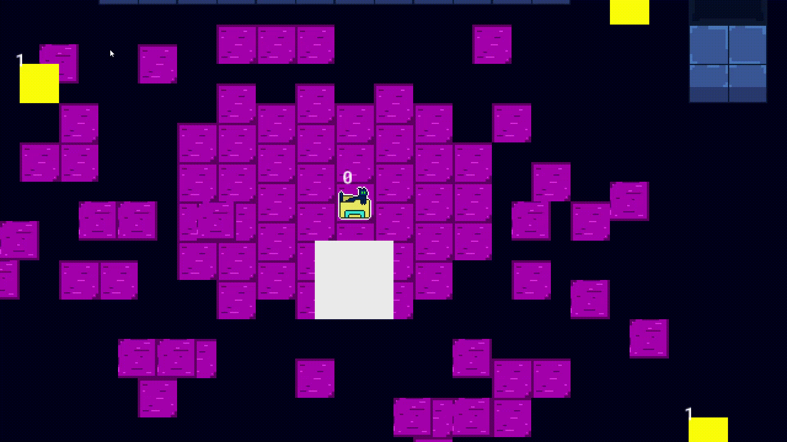

# 🐱 OsiCat

> An educational game development project focused on 2D game programming fundamentals.

## 📋 Description

**OsiCat** is a project developed as a foundation study for game development using **GameMaker**. It implements various essential systems for creating 2D games, such as state machines, chat systems, collision detection, character movement, and NPC behavior.

> ⚠️ **Status**: Project in development - not yet finalized

---

## ✨ Implemented Features

### 🤖 State Machine
A robust state machine system to control object behavior:
- `create()`, `execute()`, and `destroy()` functions for each state
- Smooth transitions between states
- Previous state tracking support
- Applied to characters, NPCs, and camera

### 💬 Chat System
An interactive dialogue system for communication with NPCs:
- Dynamic text rendering
- Customizable dialogue boxes
- NPC name display
- Character appearance speed control
- Customizable colored borders

### 🚶 Movement System
Robust player movement management:
- Intelligent keyboard input (conflict resolution with priorities)
- Directional sprite animation (front, back, sides)
- Smooth movement with configurable speed
- Support for vertical and horizontal movement

### 👾 NPCs and Behavior
- Intelligent NPCs with behavior systems
- Character collision
- Different states for each NPC
- Support for player interaction
- Interactive tutorial

### 🎮 Collision System
- Collision detection between living objects and walls
- Movement validation system
- Sprite overlap prevention

### 🗺️ Tilesets and Maps
- Tileset support for scenario construction
- Debug room for testing
- Integrated pause system

### 📹 Tutorial
In-game tutorial system to guide the player

---

## 🛠️ Tech Stack

- **Engine**: GameMaker Studio 2 (version 2023.11.1)
- **Language**: GameMaker Language (GML)
- **Platforms**: Windows, HTML5, Linux, Mac, Android, iOS, tvOS, operaGX

---

## 📁 Project Structure

```
OsiCat/
├── Project/                    # Main project
│   ├── objects/               # Game objects
│   │   ├── o_alive_parent/    # Parent class for living characters
│   │   ├── o_camera/          # Camera control
│   │   ├── o_player/          # Player
│   │   ├── o_npc0/            # NPC 1
│   │   ├── o_npc1/            # NPC 2
│   │   ├── o_wall/            # Walls/Collision
│   │   ├── o_target/          # Target/Goal
│   │   └── o_tutorial/        # Tutorial system
│   │
│   ├── scripts/               # Functions and systems
│   │   ├── scp_state_machine/ # State machine system
│   │   ├── scp_chat_box/      # Chat system
│   │   ├── scp_movement/      # Movement system
│   │   ├── scp_collision/     # Collision detection
│   │   ├── scp_npc0/          # NPC 1 behavior
│   │   ├── scp_npc1/          # NPC 2 behavior
│   │   └── scp_tutorial/      # Tutorial system
│   │
│   ├── sprites/               # Image assets
│   │   ├── s_player/          # Player sprites
│   │   ├── s_npc0/            # NPC 1 sprites
│   │   ├── s_npc1/            # NPC 2 sprites
│   │   ├── s_wall/            # Wall sprites
│   │   └── ...
│   │
│   ├── rooms/                 # Scenes/Rooms
│   │   └── rm_debug/          # Debug room
│   │
│   ├── tilesets/              # Tile maps
│   │   └── ts_debug/
│   │
│   └── fonts/                 # Custom fonts
│       └── ft_text/           # Main text font
│
└── Prototype/                 # Previous prototype
```

---

## 🎯 How It Works

### 1. **State Machine**

Each entity (player, NPC, camera) uses a state machine:

```gml
// State structure
state_create(initial_state);

// Every frame
state_execute();

// State change
state_change(new_state);
```

Each state has:
- `create()` - State initialization
- `execute()` - Logic run every frame
- `destroy()` - Cleanup before switching

### 2. **Movement System**
Handles player input and movement:
- Detects multiple simultaneous key presses
- Prioritizes movement (right > left, down > up)
- Animates sprites based on direction
- Applies configurable speed

### 3. **Chat System**


Renders dialogue progressively:
- Draws box with colored border
- Displays NPC name
- Characters appear progressively
- Supports player interaction

### 4. **Intelligent NPCs**


- Each NPC has its own behavior
- Detects collision with player
- Can be interacted with via chat system
- Use state machine for behavior

---


## 🚀 How to Run

### Requirements
- GameMaker Studio 2 (version 2023.11 or higher)
- Windows, Mac, or Linux

### Steps
1. Open GameMaker Studio 2
2. Navigate to: File → Open Project
3. Select the `Project/OsiCat.yyp` file
4. Press **F5** or click "Run" to execute
5. Press **F6** for debug (with variable viewer)

---

## 🎓 Learning Topics Covered

- ✅ State machine architecture in games
- ✅ Input systems and event handling
- ✅ Directional sprite animation
- ✅ 2D collision detection
- ✅ Camera management
- ✅ Dialogue and chat systems
- ✅ NPC behavior
- ✅ GML code organization
- ✅ Tilesets and map building
- ✅ GameMaker project structure

---

## 📝 Script Systems

### [scp_state_machine](Project/scripts/scp_state_machine/scp_state_machine.gml)
Defines the core state machine system with methods to create, execute, and switch states.

### [scp_movement](Project/scripts/scp_movement/scp_movement.gml)
Manages keyboard input, collision detection, and applies movement to objects.

### [scp_chat_box](Project/scripts/scp_chat_box/scp_chat_box.gml)
Renders dialogue boxes with character names and progressively appearing text.

### [scp_collision](Project/scripts/scp_collision/scp_collision.gml)
Validates collisions before moving objects (overlap prevention).

### [scp_npc0](Project/scripts/scp_npc0/scp_npc0.gml) and [scp_npc1](Project/scripts/scp_npc1/scp_npc1.gml)
Behavior-specific scripts for each NPC using state machines.

---

## 🔧 Customization

### Adding a New NPC
1. Create a new object in `objects/o_npc[number]/`
2. Create a script in `scripts/scp_npc[number]/` with its behavior
3. Use the state machine to define its states
4. Integrate with the chat system as needed

### Adding New Sprites
1. Import sprites in `sprites/`
2. Organize in subfolders by type (player, npc, scenery, etc)
3. Configure frame animations in GM's visual editor

### Customizing Tilesets
1. Edit or create new tilesets in `tilesets/`
2. Use them in rooms to build scenarios
3. Configure collision properties for tiles

---

## 📚 Useful Resources

- [GameMaker Documentation](https://manual.yoyogames.com/)
- [GML Reference](https://manual.yoyogames.com/GameMaker_Language/GML_Reference/GML_Reference.htm)
- [GameMaker Tutorials](https://gamemaker.io/en/tutorials)

---

## 👤 Author

Jonas

---

## 📄 License

This project is a personal study about game development. Feel free to study and learn from it!

---

**Last updated**: March 2026

